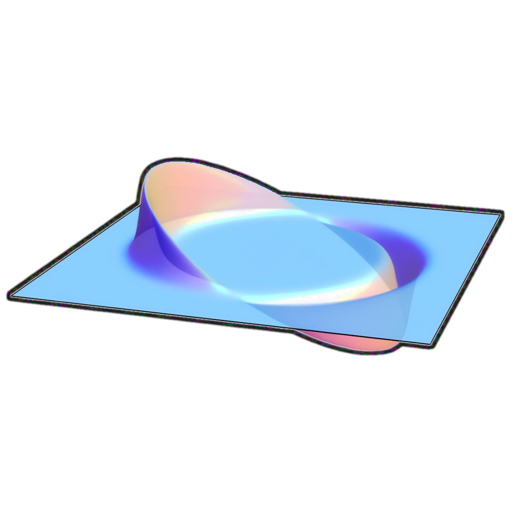

# alcubierre


###### Roblox Badge-to-Badge Place Teleporter
[](https://www.python.org/downloads/)


[](./LICENSE)

[alcubierre](https://en.wikipedia.org/wiki/Alcubierre_drive) is a [CLI](https://en.wikipedia.org/wiki/Command-line_interface)-based [Python](https://en.wikipedia.org/wiki/Python_(programming_language)) program that allows you to play multiple [Roblox](https://en.wikipedia.org/wiki/Roblox) experiences containing [player badges](https://roblox.fandom.com/wiki/User_badge) in a row, with minimal interruption to the flow. Specify what you want to play in a [text file](https://en.wikipedia.org/wiki/Text_file), and alcubierre will [automagically](https://en.wiktionary.org/wiki/automagically) figure out what to do for each line.

This program currently supports player badges, [places](https://roblox.fandom.com/wiki/Place), [universes/experiences](https://roblox.fandom.com/wiki/Experience), [users/players](https://roblox.fandom.com/wiki/User), and [groups](https://roblox.fandom.com/wiki/Group). 

It can run on Python 3.6 and above. It also supports [Bloxstrap](https://bloxstraplabs.com) and [Sober](https://sober.vinegarhq.org).

Any questions?

## Installation
To run alcubierre, you will need the same requirements as Roblox: Windows 8.1 or above, macOS 10.13 High Sierra, or any Linux distro that can support Sober. Windows 7 users will need to manually run the source code on Python 3.8 or below.

The releases tab contains binary files of this program. Download and run the executable in a terminal.

If you have Python installed and want to run the source code, you will need to use `pip install -r requirements.txt` to install the required packages. It is advised to create a virtual environment for this program ([conda](https://docs.conda.io/projects/conda/en/latest/index.html) / [venv](https://docs.python.org/3/library/venv.html)). You can then use `python .` to run the program.

## Usage
The `--help` command shows the commands you can use.

```
usage: alcubierre [-h] [--version] [--env-file ENV_FILE]
                  [--rbx-token RBX_TOKEN] [--user-id USER_ID]
                  [--awarded-threshold NUMBER] [--vote-threshold RATIO]
                  [--seconds SECONDS] [--no-bloxstrap] [--no-sober]
                  [--sober-opts SOBER_OPTS] [--open-in-browser] [--verbose]
                  [--very-verbose] [--no-detect-one-badge]
                  [--cache-directory CACHE_DIRECTORY]
                  [--user-agent USER_AGENT] [--save-response-cache]
                  [--play-sound] [--sound-pack SOUND_PACK]
                  [file_path]

There are 20 arguments available.

positional arguments:
  file_path             Filename path of Badge IDs/URLs.

options:
  -h, --help            show this help message and exit
  --version             show program's version number and exit
  --env-file, -e ENV_FILE
                        An .env file allows you to specify settings (the below
                        options) for alcubierre to follow without cluttering
                        the terminal or risking important tokens. If the file
                        doesn't exist, the program will create a template in
                        its place. More information on .env files can be found
                        in the README.
  --rbx-token, -t RBX_TOKEN
                        .ROBLOSECURITY token. By using this option, you agree
                        that this is your unique token and not anyone else's.
                        DO NOT SHARE YOUR ROBLOX TOKEN WITH ANYONE! More info
                        can be found here:
                        https://ro.py.jmk.gg/dev/tutorials/roblosecurity/
  --user-id, -u USER_ID
                        Specify a Roblox User ID to check inventory for
                        badges. Not required if you're already using --rbx-
                        token. The User ID argument takes priority from --rbx-
                        token.
  --awarded-threshold, -at NUMBER
                        Threshold of players with the badge. If the badge has
                        a lower number than the threshold, it gets skipped.
                        Setting to -1 (default) disables the threshold.
  --vote-threshold, -vt RATIO
                        Threshold ratio of likes and dislikes. If a game has a
                        lower ratio than the threshold, it gets skipped.
                        Setting to -1 (default) disables the threshold.
  --seconds, -s SECONDS
                        How many seconds before killing the Roblox process.
                        Setting to -1 (default) disables the timer.
  --no-bloxstrap, -nbs  Windows only! Don't use Bloxstrap to open Roblox (not
                        recommended). When this option is not in use, the
                        program automagically detects if Bloxstrap is
                        installed and uses it if so. Bloxstrap website:
                        https://bloxstraplabs.com
  --no-sober, -nsob     Linux only! Don't use Sober to open Roblox. When this
                        option is not in use, the program automagically
                        detects if Sober is installed and uses it if so. Sober
                        website: https://sober.vinegarhq.org
  --sober-opts, -sopts SOBER_OPTS
                        Linux only! Commands to give Sober. Connect with an
                        equal sign for it to work (`--sober-opts='--opengl'`)
                        See --no-sober for more info on Sober.
  --open-in-browser, -ob
                        Opens the Roblox place in the default browser. Highly
                        recommended, but set to False as default.
  --verbose, -v         Verbose mode. Prints out things to help with
                        debugging.
  --very-verbose, -vv   Very verbose mode. Print out as many things as it can
                        to help with debugging. Not recommended as it can slow
                        down the program.
  --no-detect-one-badge, -ndob
                        Turns off one badge place detection, which
                        automatically closes Roblox after the user has
                        collected the solo badge on a place.
  --cache-directory, -cd CACHE_DIRECTORY
                        The directory where cache data is kept.
  --user-agent, -ua USER_AGENT
                        Sets the user agent for requests made by the program.
  --save-response-cache, -src
                        Save API responses from Roblox into a file. This can
                        save bandwidth, at the cost of new information from
                        already checked responses being ignored.
  --play-sound, -ps     Play sounds for important context.
  --sound-pack SOUND_PACK
                        Sound packs to choose from: ['piano', 'tts']
```

### Guest mode
In guest mode, 90% of the features still work. A Roblox token is needed for detecting place playability and less harsh rate limits. To grab your token safely, visit ro.py's page on .ROBLOSECURITY tokens: https://ro.py.jmk.gg/dev/tutorials/roblosecurity

### Creating a list
You can create a list with URLs, or with "comma-comma" strings:
```text
https://www.roblox.com/games/1818/Classic-Crossroads
place::1818
game::1818
https://www.roblox.com/users/1/profile
user::1
universe::1234
https://www.roblox.com/groups/4199740/Roblox-Video-Stars
group::4199740
```

### .env files
If you want to avoid showing sensitive data through the terminal, you can create an .env file.
```text
RBX_TOKEN="TOKEN_HERE"
USER_AGENT="USER_AGENT_HERE"
```
See [.envs/.example.env](.envs/.example.env) for settings that are currently supported through .env.

## Development
See [docs/DEVELOPMENT.md](docs/DEVELOPMENT.md)

## License and Credits
alcubierre is licensed under the GNU General Public License v3.0. Check the file [LICENSE](./LICENSE) for details.
```
This program is free software: you can redistribute it and/or modify
it under the terms of the GNU General Public License as published by
the Free Software Foundation, either version 3 of the License, or
(at your option) any later version.

This program is distributed in the hope that it will be useful,
but WITHOUT ANY WARRANTY; without even the implied warranty of
MERCHANTABILITY or FITNESS FOR A PARTICULAR PURPOSE. See the
GNU General Public License for more details.
```

The rate limit sleep code for getRequestURL() was derived from [ArchiveTeam/roblox-marketplace-comments-grab](https://github.com/ArchiveTeam/roblox-marketplace-comments-grab), which is under The Unlicense. For more information, please refer to https://unlicense.org.

The icon is a modified derivative of [File:Alcubierre.png](https://commons.wikimedia.org/wiki/File:Alcubierre.png) by [AllenMcC.](https://commons.wikimedia.org/wiki/User:AllenMcC.), which is licensed under [Creative Commons Attribution-Share Alike 3.0 Unported](https://creativecommons.org/licenses/by-sa/3.0) 

Therefore, the alcubierre icon (located in `docs/icon.*`) is licensed under [Creative Commons Attribution-ShareAlike 4.0 International](https://creativecommons.org/licenses/by-sa/4.0/?ref=chooser-v1) 